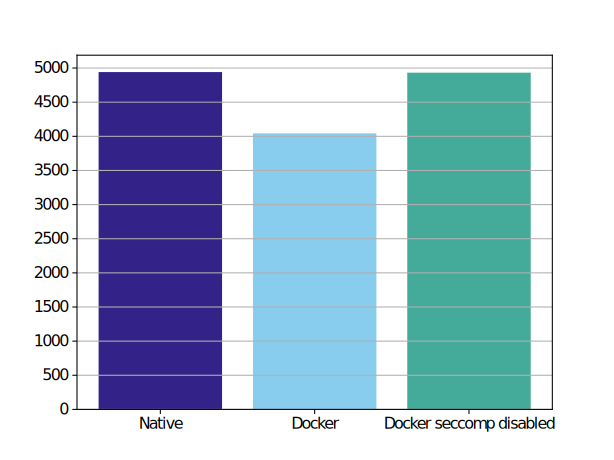

# Deployment environment
This document describes the deployment environment of the system. 

## Requirements
There are a few key requirements for the system that will be explained in this section. 

The system utilizes Optitrack for tracking the coil and the head of the subject. Optitrack provides the tracking data via Motive. As Motive is only supported on Windows, the system requires at least a Windows machine to operate.

As Windows is not a real-time operating system, it is not suitable for running the real-time critical parts of the system. Thus, we need at least one additional machine for running the real-time critical sections, for example a Linux patched with PREEMPT\_RT. 

These two points are the key requirements for designing the production environment for the system. The system requires an architecture that is distributed across two machines, one Windows and one Linux machine. 

One additional aspect that, while not strictly a requirement, should be considered when designing the deployment environment is that the system will be deployed in different Universities: Aalto, Chieti, and Tübingen. Hence, there should be an easy way to deploy updated versions of the software in all locations regardless of whether without manually going to the site and downloading newest versions.

## Containers

In contrast to virtual machines, containers have negligible overhead. This is demonstrated in Table 1, where it is shown that the performance is almost identical when running directly on the OS and running on Docker. 

|      | Mean  | Median | Std   | Max   | Min   | Over 2.0 ms (\%) |
|--------|-------|--------|-------|-------|-------|------------------|
| Native | 1.708 | 1.620  | 0.258 | 3.940 | 1.597 | 9.910            |
| Docker | 1.715 | 1.626  | 0.211 | 2.599 | 1.569 | 5.405            |

The measurement was performed with two ROS2 nodes: EEG simulator and EEG processor where EEG processor is utilizing phastimate. We can see that the performance of EEG processor is almost exactly the same. However, if we measure the performance of EEG simulator with `ros2 topic hz /eeg/raw`, we can see that the EEG simulator is actually almost 20% slower on Docker (Figure below). 

According to [1], this is most likely due to seccomp, secure computing mode, a Linux kernel feature. As shown by [2], the default security computing mode used by Docker introduces significant overhead of about 20%. This is consistent with the results from the above test with `ros2 topic hz /eeg/raw`. This performance issue is fixed in newer versions of seccomp [3], but Docker currently still utilizes an older version that does include these performance fixes. An alternative fix is to simply disable seccomp and then Docker will reach its true performance potential. The effects of disabling seccomp are demonstrated in Figure above. In addition, it is also possible to run docker in privileged mode as it disables all security features. This is done with EEG processor as it requires permissions to set scheduling priority and lock memory and explains why the experiment didn't see performance issues with that node.

## Orchestration
Deploying and managing a single application on a single machine or a server is relatively straightforward. However, as the number of applications, services, and other moving parts increase, the more complex the managing becomes. Be it on the cloud or on premise, manually managing services and applications quickly becomes infeasible in practice as their numbers and complexity increase. Orchestration is a way to automatically configure, manage, and deploy applications and services.

It is possible to orchestrate applications and services without virtualization with tools such as Ansible. Moreover, it is also possible to orchestrate containers. Container orchestration tools enable you to deploy and manage containers with a microservice architecture that are distributed across several containers and several hosts. There are various tools for orchestrating containers, such as Kubernetes and Docker swarm.

The most important features that container orchestration tools provides for us include easy container networking across hosts and automatic deploying of containers. 

## Docker swarm
Docker swarm is a tool for deploying and managing docker applications across many hosts. It is natively built into Docker. Docker swarm utilizes the same Docker Compose specification that we already utilize for local development with Docker Compose. Following the same specification vastly helps adopting it to a project that already utilizes Docker Compose as the configuration needs only slight changes. These factors make it a more attractive option than its main competitor Kubernetes that introduces its own concepts and syntax.

### Multicast
However, there are some caveats to Docker swarm that makes it a bit more complicated than simply using Docker compose. ROS2 utilizes DDS as the communication middleware. DDS requires multicast for discovering other participants in the network. By default, docker swarm utilizes overlay networks that do not support multicast traffic [5]. Neither does bridge networks support multicast [6]. There are a few solutions for this problem but all of them have their own problems. For instance, one option would be to utilize the macvlan network adapter, but it is not supported on windows [4]. Another option is to use virtual ethernet with the ipvlan driver, but it works only on the same host [7]. A third, more popular option, is to utilize Weave net [8] as the network driver. 

Our Docker swarm configuration utilizes the third option, Weave net, to solve the issues with multicast and Docker swarm. 

As a conclusion, it is difficult to work with docker swarm when using multicast and a windows host. As a note, one option would be to use docker compose instead of docker swarm by setting network_mode to host and pic to host, but again we face the limitations of windows as network_mode option is not supported on windows.

### Other challenges
While using Weave net fixes the multicast related challenges in Docker swarm, there are a few additional problems:
- Docker swarm does not support privileged containers. This is solved by running the containers as docker-in-docker.
- Optitrack bridge requires network_mode `host` to connect to Motive. Network mode `host` is not supported by Windows. Hence, it must be run on a Linux computer. However, other nodes cannot communicate with a node that has network mode `host`. So we cannot run any ROS nodes on the Windows computer. There are two options to solve this issue: 1) use three computers: One windows with Motive, one Linux with non-real-time nodes, and on real-time Linux with real-time nodes, or 2) use two computers: One Windows with Motive, and one Linux with all ROS2 nodes. In theory, running all nodes on a single computer should not be a problem as the real-time ones will have higher priority anyway.
- Volume mapping is cumbersome. This is solved by mapping the whole $HOME directory.
- Environment variables cannot be automatically read from .env. They must be manually configured in `docker-stack.yml`.

## Docker Compose
The easiest solution is most likely to simply discard Docker swarm and continue using Docker Compose. Maybe run Motive on the EEG deck laptop, neuronavigation and other non-real-time nodes on one Linux computer (with network mode `host`), and real-time nodes (also with network mode `host`) on the PC which is connected to the mTMS device.

## References
[1] https://pythonspeed.com/articles/docker-performance-overhead/  
[2] https://github.com/moby/moby/issues/41389  
[3] https://github.com/seccomp/libseccomp/issues/116  
[4] https://docs.docker.com/network/network-tutorial-macvlan/  
[5] https://github.com/moby/libnetwork/issues/552  
[6] https://github.com/moby/libnetwork/issues/2397  
[7] https://github.com/moby/libnetwork/issues/552#issuecomment-1227821940  
[8] https://www.weave.works/oss/net/  
